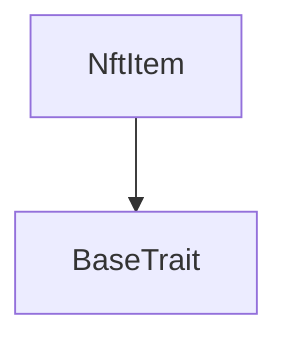
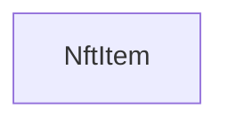

# Tact compilation report
Contract: NftItem
BoC Size: 612 bytes

## Structures (Structs and Messages)
Total structures: 24

### DataSize
TL-B: `_ cells:int257 bits:int257 refs:int257 = DataSize`
Signature: `DataSize{cells:int257,bits:int257,refs:int257}`

### SignedBundle
TL-B: `_ signature:fixed_bytes64 signedData:remainder<slice> = SignedBundle`
Signature: `SignedBundle{signature:fixed_bytes64,signedData:remainder<slice>}`

### StateInit
TL-B: `_ code:^cell data:^cell = StateInit`
Signature: `StateInit{code:^cell,data:^cell}`

### Context
TL-B: `_ bounceable:bool sender:address value:int257 raw:^slice = Context`
Signature: `Context{bounceable:bool,sender:address,value:int257,raw:^slice}`

### SendParameters
TL-B: `_ mode:int257 body:Maybe ^cell code:Maybe ^cell data:Maybe ^cell value:int257 to:address bounce:bool = SendParameters`
Signature: `SendParameters{mode:int257,body:Maybe ^cell,code:Maybe ^cell,data:Maybe ^cell,value:int257,to:address,bounce:bool}`

### MessageParameters
TL-B: `_ mode:int257 body:Maybe ^cell value:int257 to:address bounce:bool = MessageParameters`
Signature: `MessageParameters{mode:int257,body:Maybe ^cell,value:int257,to:address,bounce:bool}`

### DeployParameters
TL-B: `_ mode:int257 body:Maybe ^cell value:int257 bounce:bool init:StateInit{code:^cell,data:^cell} = DeployParameters`
Signature: `DeployParameters{mode:int257,body:Maybe ^cell,value:int257,bounce:bool,init:StateInit{code:^cell,data:^cell}}`

### StdAddress
TL-B: `_ workchain:int8 address:uint256 = StdAddress`
Signature: `StdAddress{workchain:int8,address:uint256}`

### VarAddress
TL-B: `_ workchain:int32 address:^slice = VarAddress`
Signature: `VarAddress{workchain:int32,address:^slice}`

### BasechainAddress
TL-B: `_ hash:Maybe int257 = BasechainAddress`
Signature: `BasechainAddress{hash:Maybe int257}`

### Mint
TL-B: `mint#6d696e74 queryId:uint64 metadataIndex:uint32 contentUrl:^string newOwner:address validUntil:uint32 signature:^slice = Mint`
Signature: `Mint{queryId:uint64,metadataIndex:uint32,contentUrl:^string,newOwner:address,validUntil:uint32,signature:^slice}`

### Initialize
TL-B: `initialize#696e6974 owner:address content:^cell = Initialize`
Signature: `Initialize{owner:address,content:^cell}`

### Transfer
TL-B: `transfer#5fcc3d14 queryId:uint64 newOwner:address responseDestination:address customPayload:Maybe ^cell forwardAmount:coins forwardPayload:remainder<slice> = Transfer`
Signature: `Transfer{queryId:uint64,newOwner:address,responseDestination:address,customPayload:Maybe ^cell,forwardAmount:coins,forwardPayload:remainder<slice>}`

### OwnershipAssigned
TL-B: `ownership_assigned#05138d91 queryId:uint64 prevOwner:address forwardPayload:remainder<slice> = OwnershipAssigned`
Signature: `OwnershipAssigned{queryId:uint64,prevOwner:address,forwardPayload:remainder<slice>}`

### Excesses
TL-B: `excesses#d53276db queryId:uint64 = Excesses`
Signature: `Excesses{queryId:uint64}`

### GetStaticData
TL-B: `get_static_data#2fcb26a2 queryId:uint64 = GetStaticData`
Signature: `GetStaticData{queryId:uint64}`

### ReportStaticData
TL-B: `report_static_data#8b771735 queryId:uint64 index:uint256 collection:address = ReportStaticData`
Signature: `ReportStaticData{queryId:uint64,index:uint256,collection:address}`

### GetRoyaltyParams
TL-B: `get_royalty_params#693d3950 queryId:uint64 = GetRoyaltyParams`
Signature: `GetRoyaltyParams{queryId:uint64}`

### ReportRoyaltyParams
TL-B: `report_royalty_params#a8cb00ad queryId:uint64 numerator:uint16 denominator:uint16 destination:address = ReportRoyaltyParams`
Signature: `ReportRoyaltyParams{queryId:uint64,numerator:uint16,denominator:uint16,destination:address}`

### NftItem$Data
TL-B: `_ index:uint256 collection:address owner:address content:^cell inited:bool = NftItem`
Signature: `NftItem{index:uint256,collection:address,owner:address,content:^cell,inited:bool}`

### NftData
TL-B: `_ inited:bool index:int257 collection:address owner:address individualContent:^cell = NftData`
Signature: `NftData{inited:bool,index:int257,collection:address,owner:address,individualContent:^cell}`

### NftCollection$Data
TL-B: `_ owner:address nextItemIndex:uint256 collectionContentUrl:^string metadataIndexUrl:^string royaltyDestination:address authPublicKey:uint256 mintedPerMetadataIndex:dict<int, int> = NftCollection`
Signature: `NftCollection{owner:address,nextItemIndex:uint256,collectionContentUrl:^string,metadataIndexUrl:^string,royaltyDestination:address,authPublicKey:uint256,mintedPerMetadataIndex:dict<int, int>}`

### CollectionData
TL-B: `_ nextItemIndex:int257 collectionContent:^cell ownerAddress:address = CollectionData`
Signature: `CollectionData{nextItemIndex:int257,collectionContent:^cell,ownerAddress:address}`

### RoyaltyParams
TL-B: `_ numerator:int257 denominator:int257 destination:address = RoyaltyParams`
Signature: `RoyaltyParams{numerator:int257,denominator:int257,destination:address}`

## Get methods
Total get methods: 1

## get_nft_data
No arguments

## Exit codes
* 2: Stack underflow
* 3: Stack overflow
* 4: Integer overflow
* 5: Integer out of expected range
* 6: Invalid opcode
* 7: Type check error
* 8: Cell overflow
* 9: Cell underflow
* 10: Dictionary error
* 11: 'Unknown' error
* 12: Fatal error
* 13: Out of gas error
* 14: Virtualization error
* 32: Action list is invalid
* 33: Action list is too long
* 34: Action is invalid or not supported
* 35: Invalid source address in outbound message
* 36: Invalid destination address in outbound message
* 37: Not enough Toncoin
* 38: Not enough extra currencies
* 39: Outbound message does not fit into a cell after rewriting
* 40: Cannot process a message
* 41: Library reference is null
* 42: Library change action error
* 43: Exceeded maximum number of cells in the library or the maximum depth of the Merkle tree
* 50: Account state size exceeded limits
* 128: Null reference exception
* 129: Invalid serialization prefix
* 130: Invalid incoming message
* 131: Constraints error
* 132: Access denied
* 133: Contract stopped
* 134: Invalid argument
* 135: Code of a contract was not found
* 136: Invalid standard address
* 138: Not a basechain address
* 3838: signature expired
* 8704: already initialized
* 24105: only collection can initialize
* 29252: not initialized
* 49280: not owner
* 57400: invalid signature

## Trait inheritance diagram

## Contract dependency diagram

